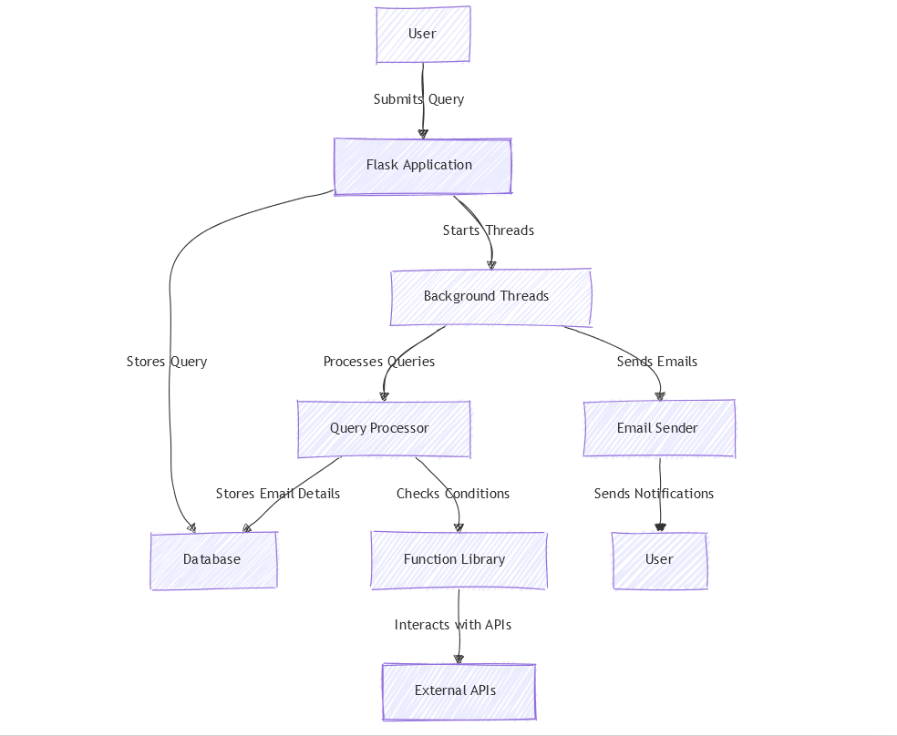
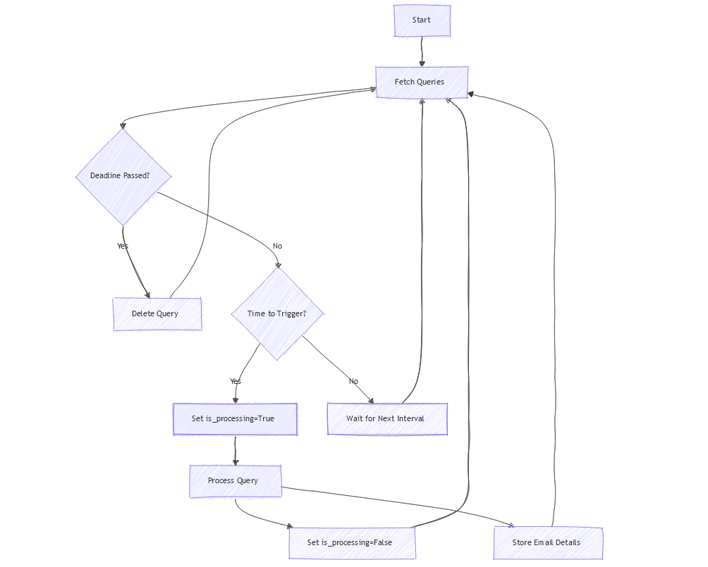

# Auto-Notifier

## Introduction

Auto-Notifier is a Flask web application that allows users to set up notifications triggered on specific queries or events. When certain conditions are met, the application sends an email notification to the user.

## Features

- **User Input**: Users can submit queries and specify trigger conditions.
- **Automated Processing**: The app periodically processes the queries to check if the trigger conditions are met.
- **Email Notifications**: Sends an email to the user when the trigger occurs.
- **Extensible Functions**: Supports various functions like web search, news search, flight search, and more.
- **Database Storage**: Stores queries and emails using SQLAlchemy with a SQLite database.

## Application Architecture

The application architecture is visualized in the flowchart above.

The Auto-Notifier application consists of several components that work together to provide the notification service:

- **Flask Application (`app.py`)**: Handles HTTP requests, routes, and renders templates. It also starts background threads for processing queries and sending emails.
- **User Interface**: Provides a web form where users can submit their queries and specify trigger conditions, deadlines, and email addresses.
- **Database Models (`models.py`)**: Defines the data models using SQLAlchemy for storing user queries and emails in a SQLite database.
- **Query Processor (`query.py`)**: Processes the stored queries, checks if the trigger conditions are met, and interacts with external APIs to gather necessary data.
- **Function Library (`fn.py`)**: Contains functions that perform specific tasks like web searches, news searches, flight searches, and number comparisons.
- **Email Sender (`mailer.py`)**: Sends email notifications to users when their specified triggers occur, utilizing the Sendinblue API.
- **Background Threads**: Separate threads that periodically process user queries and send out pending emails to ensure timely notifications.
- **Templates**: HTML templates for rendering the web pages and confirmation screens.
- **External APIs**: Utilizes APIs such as OpenAI or XAI for language processing, GNews for news searches, and Sendinblue for sending emails.

## Flowcharts

### Overall Architecture

## Environment Variables

The following environment variables need to be set for the application to function correctly:

- `XAI_API_KEY`: XAI API KEY (grok-beta).
- `MAILSEND_API_KEY`: API key for the MailSend service used to send emails.
- `RAPIDAPI_KEY`: API key for accessing the RapidAPI services used for flight searches.